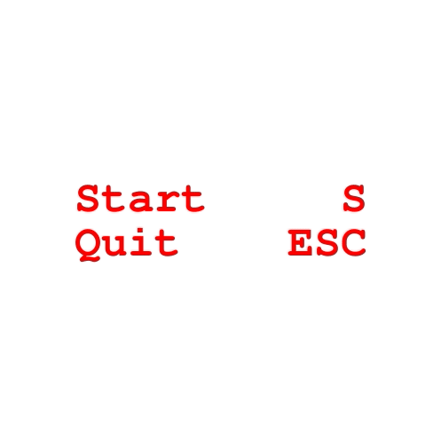

Implementation of the snake game in python.

</img>

Run the game in easy mode (by default):
```sh
poetry run python snake.py
```

Run the game in classic mode:
```sh
poetry run python snake.py --wall --body --speed
```

Run tests:
```sh
poetry run python -m unittest
```

Tags: python, game, snake, pygame, unittest
